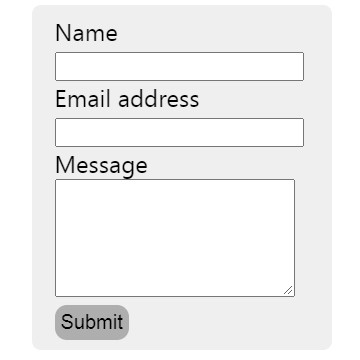

<a href="https://ecstatic-thompson-3043cf.netlify.app/">Try it!</a>

p align="center">


</p>

This project was bootstrapped with [Create React App](https://github.com/facebook/create-react-app).

### Getting Started :computer:

```sh
git clone https://github.com/muNeves3/Netflix-clone
```

## Install

```sh
yarn install
```

## Usage

```sh
yarn run start
```

## Run tests

```sh
yarn run test
```
